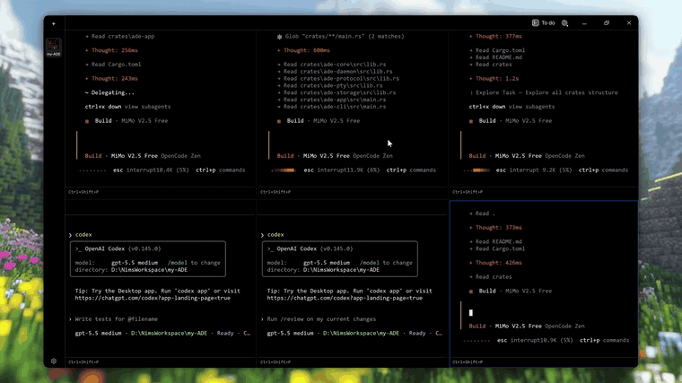

<table>
  <tr>
    <td width="132" align="center">
      
    </td>
    <td>
      <h1>Termy</h1>
      <p><strong>A Windows-first terminal workspace manager, built in Rust.</strong></p>
      <p>Termy opens real PowerShell and Command Prompt sessions through Windows ConPTY, renders them in a GPU-accelerated desktop window, and keeps project work organized in persistent, folder-backed workspaces.</p>
      <p>
        
        
        
        
        
        
      </p>
    </td>
  </tr>
</table>

<p>
  <a href="https://github.com/GitNimay/ADE-agentic-coding-environment/releases/latest/download/windows-x64-termy.exe">
    
  </a>
  
  
</p>

## Demo

<a href="docs/assets/termy-demo.mp4">
  
</a>

## Features

- **Project workspaces:** Keep named folders, panes, and working context together.
- **Real Windows terminals:** Run PowerShell, PowerShell Core, or Command Prompt through ConPTY.
- **Split panes:** Arrange up to six live terminals in one workspace.
- **Session continuity:** Keep shells running after the desktop window closes.
- **Persistent state:** Restore layouts, panes, Git context, and recent terminal output.
- **Fast desktop UI:** Render terminal cells through `eframe`, `egui`, and `wgpu`.

## Installation

### Download

1. Download the latest Windows build: [windows-x64-termy.exe](https://github.com/GitNimay/ADE-agentic-coding-environment/releases/latest/download/windows-x64-termy.exe).
2. Move the executable to a permanent folder.
3. Run `windows-x64-termy.exe`.

Termy currently targets Windows 11 x64. The standalone build is unsigned, so Windows SmartScreen may show an unknown publisher warning.

### Manual Installation

Clone the repository, build the desktop app, then run it locally:

```powershell
git clone https://github.com/GitNimay/ADE-agentic-coding-environment.git
cd ADE-agentic-coding-environment
cargo build -p ade-app
.\target\debug\ade-app.exe
```

Requirements:

- Windows 11 x64
- Rust 1.95 or newer
- Git

## Documentation

- [Feature guide](docs/features.md)
- [Architecture notes](docs/architecture.md)
- [Release process](docs/releasing.md)

---

<sub>Licensed under MIT OR Apache-2.0. Built by [Nimesh](https://www.n1m35h.in/).</sub>
